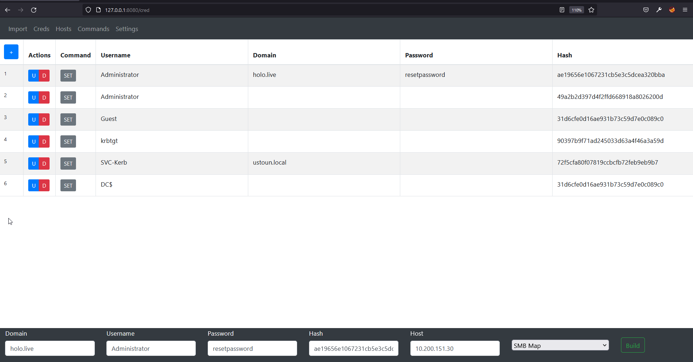
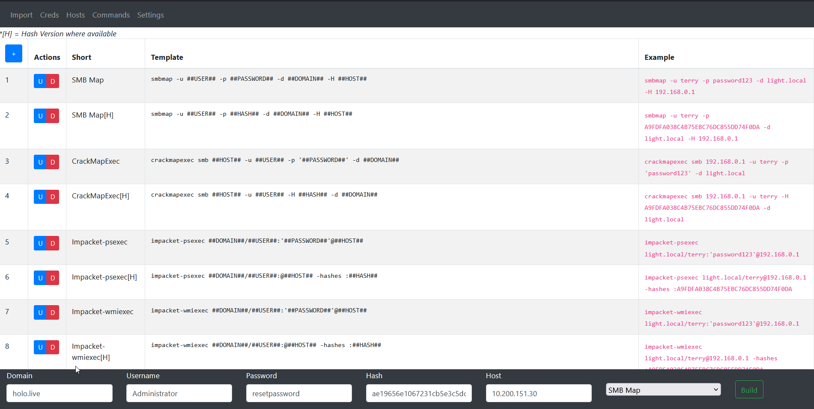

Great Engagement Database

A tool to keep me organized and convert my creds from one format to another. The executable is self contained, and will only write a database for persistant data. Run the executable anywhere.

## Database
Installation for windows?
https://medium.com/@yaravind/go-sqlite-on-windows-f91ef2dacfe

## Todo

Deployment:
- [ ] Localhost only?
- [ ] Custom Port 
- [ ] Custom DB Name
- [ ] Encrypt Database

Settings:
- [ ] Add Database rebuild function
- [ ] Add Json Custom Command Import
- [ ] Add Custom Command Form
- [ ] Add Json Import/Export for full project

Command Bar:
- [ ] Add Clear Option
- [ ] Add Create Entries for current options
- [ ] Implement Command History

Parsing:
- [ ] Add Local admin parsing for crackmapexec

Hosts:
- [ ] Implement is local admins section

Mysql:
- [ ] Implement Duplicate Checking
  (Maybe add a hash check where all coloums are concated and md5 hash is created. Compare will all coloums....)
- [ ] Custom SQL Database Location

Frontend:
- [ ] Remake import page

Codebase:
- [x] implement embeded file system
